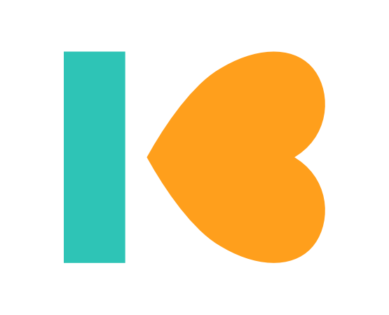

<div align="center">
    
    <h1>Kudos Donations</h1>
    Easily receive donations in WordPress via Mollie
    <br>
    <br>
    
</div>

## Development

Use the [yarn](https://yarnpkg.com/) and [composer](https://getcomposer.org/) package managers to install the required dependencies.

```bash
# install dependencies
yarn install
composer install

# start development
yarn run start

# build assets for export
yarn run build
```

## Contributing
Pull requests are welcome. For major changes, please open an issue first to discuss what you would like to change.

Please make sure to update tests as appropriate.

## License
[MIT](https://choosealicense.com/licenses/mit/)